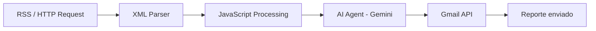

# 📰 AutoNews: Pipeline Automatizado de Inteligencia Artificial


Proyecto desarrollado en el marco de la **Tecnicatura Superior en Ciencia de Datos e Inteligencia Artificial**.

> **Última revisión de la documentación:** 26 de mayo de 2026, 22:58 (UTC-03, America/Argentina/Buenos_Aires).

Este repositorio contiene la arquitectura y configuración de un flujo de automatización *self-hosted* que extrae, procesa y distribuye información utilizando integraciones API y Modelos de Lenguaje de Gran Escala (LLMs).

## 🚀 Descripción del Proyecto

El objetivo de este sistema es mitigar la sobrecarga de información mediante un curador de contenidos autónomo. El pipeline se ejecuta de forma local, consume el feed de noticias de tecnología/ciencia (vía RSS), normaliza la estructura de datos mediante scripting, delega la síntesis semántica al modelo **Google Gemini**, y distribuye el reporte final a través de la API de **Gmail** utilizando autenticación segura OAuth2.

## 🧭 Flujo del Pipeline y Fechas

Esta es la parte central del proyecto: cada ejecución del flujo conserva la fecha original de publicación de las noticias y agrega la fecha real de procesamiento/envío del reporte.

| Etapa | Nodo / Tecnología | Fecha utilizada | Resultado |
| --- | --- | --- | --- |
| 1 | **HTTP Request / XML** | `pubDate` del RSS | Extrae noticias en crudo desde fuentes RSS y mantiene la fecha original publicada por la fuente. |
| 2 | **JavaScript Processing** | Fecha de ejecución local de n8n | Limpia metadatos, normaliza el JSON y prepara los campos que recibirá el modelo. |
| 3 | **AI Agent (Gemini)** | Fecha de procesamiento del reporte | Resume, clasifica y estructura la información clave para el informe final. |
| 4 | **Gmail API** | Fecha real de envío del correo | Distribuye el reporte automatizado usando credenciales OAuth2. |

### 🗓️ Convención de fechas

- **Fecha de publicación:** proviene del campo `pubDate` del RSS y representa cuándo fue publicada la noticia original.
- **Fecha de procesamiento:** corresponde al momento en que n8n ejecuta el flujo en el entorno local.
- **Fecha de envío:** corresponde al momento en que Gmail entrega el reporte final.
- **Zona horaria de referencia:** `America/Argentina/Buenos_Aires` (`UTC-03`).

## ⚙️ Arquitectura del Flujo



## 📂 Estructura del Repositorio

```text
AutoNews/
├── docs/
│   ├── arquitectura.md                 # Diseño técnico y etapas del pipeline
│   ├── configuracion-google-cloud.md   # Guía para Gmail API y OAuth2
│   └── prompts-gemini.md               # Prompts utilizados para generar reportes
├── screenshots/
│   ├── 01-workflow-completo.png        # Evidencia visual del flujo completo en n8n
│   └── 02-email-recibido.png           # Ejemplo del reporte enviado por Gmail
├── workflows/
│   └── resumen_noticias_ia.json        # Workflow exportado desde n8n
├── .env.example                        # Plantilla de variables de entorno
├── .gitignore                          # Exclusiones para credenciales y archivos locales
├── LICENSE                             # Licencia MIT
├── README.md                           # Documentación principal del proyecto
└── Trabajo Práctico...pdf              # Informe académico del proyecto
```

## 🛠️ Requisitos Previos

Para ejecutar este proyecto en un entorno local (optimizado para macOS / procesadores Apple Silicon), se requiere:

- **n8n:** instalado de forma local (vía `npm` o Docker).
- **Google Cloud Console:** un proyecto activo con la *Gmail API* habilitada y credenciales OAuth2 configuradas (Client ID & Secret).
- **Google AI Studio:** una API Key válida para consumir el modelo Gemini.

## 💻 Instalación y Despliegue

**1. Clonar el repositorio:**

```bash
git clone https://github.com/emilianorlando-collab/AutoNews.git
cd AutoNews
```

**2. Configurar el entorno:**

- Duplica el archivo `.env.example` y renómbralo a `.env`.
- Completa tus credenciales privadas (Gemini API Key, Google Client ID y Secret).

**3. Importar el flujo:**

- Inicia tu servidor local de n8n.
- Accede a la interfaz web (por defecto `http://localhost:5678`).
- En el panel principal, selecciona *Import from File* y elige el archivo `.json` ubicado en la carpeta `workflows/`.
- Conecta tus credenciales de Google cuando el nodo de Gmail lo solicite.

## 📄 Licencia

Este proyecto se distribuye bajo la licencia MIT. Consulta el archivo `LICENSE` para más detalles.
