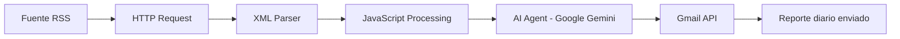

# Arquitectura del Pipeline AutoNews

AutoNews es un flujo automatizado construido con **n8n**, **Google Gemini** y **Gmail API** para recopilar noticias tecnológicas del día, procesarlas con inteligencia artificial y enviar un reporte final por correo electrónico.

El objetivo principal del sistema es reducir la sobrecarga informativa mediante un pipeline autónomo que extrae información desde fuentes RSS, normaliza los datos, genera resúmenes con un modelo de lenguaje y distribuye el resultado en formato de reporte.

## Flujo General



## Componentes Principales

| Etapa | Componente | Responsabilidad |
| --- | --- | --- |
| Extracción | HTTP Request / RSS | Obtiene las noticias desde una fuente RSS de tecnología o ciencia. |
| Parsing | XML Parser | Convierte el contenido XML del RSS en una estructura procesable. |
| Normalización | JavaScript Processing | Limpia campos, extrae metadatos relevantes y prepara el JSON para el modelo. |
| Síntesis | Google Gemini | Resume, clasifica y organiza las noticias más importantes del día. |
| Distribución | Gmail API | Envía el reporte final mediante una cuenta autenticada con OAuth2. |

## Descripción de las Etapas

### 1. Extracción de noticias

El flujo inicia con un nodo **HTTP Request** que consulta una fuente RSS. El resultado original suele venir en formato XML e incluye campos como:

- Título de la noticia.
- Enlace original.
- Fecha de publicación.
- Descripción o fragmento inicial.
- Fuente.

La fecha original de la noticia se obtiene desde el campo `pubDate` del RSS cuando está disponible.

### 2. Conversión y normalización

El contenido XML se convierte a una estructura JSON para facilitar el tratamiento de datos dentro de n8n.

Luego, un nodo de procesamiento en **JavaScript** limpia y normaliza los registros. Esta etapa puede incluir:

- Eliminación de campos innecesarios.
- Limpieza de etiquetas HTML.
- Normalización de fechas.
- Selección de noticias relevantes.
- Preparación del payload que se enviará a Gemini.

### 3. Procesamiento con inteligencia artificial

El nodo **AI Agent** utiliza **Google Gemini** para transformar las noticias en un reporte legible. El modelo recibe las noticias normalizadas y genera una salida estructurada con:

- Resumen general.
- Noticias destacadas.
- Categorías temáticas.
- Enlaces de referencia.
- Redacción clara para envío por email.

### 4. Envío del reporte

El resultado generado por Gemini se envía mediante la **Gmail API**. La autenticación se realiza con OAuth2 para evitar el uso directo de contraseñas.

El correo final contiene el reporte tecnológico del día y puede enviarse a una o más direcciones configuradas dentro del flujo de n8n.

## Manejo de Fechas

AutoNews diferencia tres tipos de fecha:

| Tipo de fecha | Origen | Uso |
| --- | --- | --- |
| Fecha de publicación | Campo `pubDate` del RSS | Identifica cuándo fue publicada cada noticia. |
| Fecha de procesamiento | Ejecución local de n8n | Indica cuándo se generó el reporte. |
| Fecha de envío | Gmail API | Indica cuándo se distribuyó el reporte final. |

La zona horaria de referencia del proyecto es:

```text
America/Argentina/Buenos_Aires (UTC-03)
```

## Consideraciones de Diseño

- El pipeline es modular: cada nodo cumple una responsabilidad específica.
- Las credenciales se gestionan fuera del repositorio mediante variables de entorno y OAuth2.
- El workflow puede ejecutarse manualmente o programarse para correr de forma diaria.
- La salida final está pensada para ser útil, breve y accionable.

## Posibles Mejoras Futuras

- Agregar múltiples fuentes RSS.
- Deduplicar noticias repetidas entre distintas fuentes.
- Clasificar noticias por categorías como IA, ciberseguridad, hardware, software y ciencia.
- Guardar reportes históricos en Google Drive o una base de datos.
- Enviar el reporte por canales adicionales como Telegram, Slack o Discord.
- Incorporar métricas de ejecución y manejo de errores.
